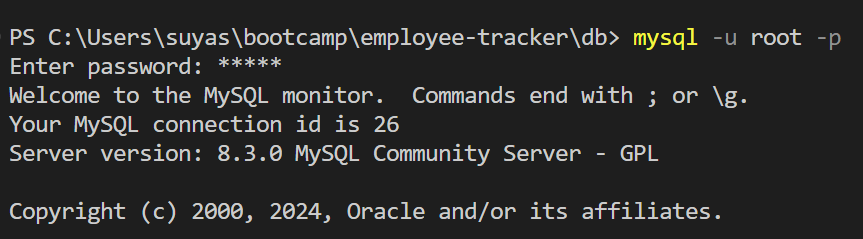

[](https://www.npmjs.com/package/inquirer) [](https://nodejs.org/en) [](https://www.npmjs.com/) [](https://www.mysql.com/)


<div align="right"> 
<a href= "http://www.wtfpl.net/about/"></a>
</div>

# Employee Tracker    

This app lets users view and manage the departments, job roles, and employees of a given company.

##  Description

Through commandline interface, the users can view departments, add a new department, update and delete an existing department. Similarly, job roles and employes can be managed. 

By creating this project, I learnt to create `modules` which enable us to separate logically distinct part of the project into different scripting files, and export and import those modules where needed. This project espically helped me understand the complex interconnection between modules. I was able to grasp the concept of modular programming and asynchronous JavaScript.

I also learnt to use various third party packages in `node_modules` such as `chalk`, `figures`, `log-symbols`. I also learnt [`ANSI Escape Codes`](https://gist.github.com/fnky/458719343aabd01cfb17a3a4f7296797), which helps to change the style of console log text. I also learnt to design `MySql` database schema, populate relational data, and perform various `CRUD` queries.


## Table of Contents

1. [Installation](#installation)
1. [Usage](#usage)
1. [Issues](#issues)
1. [Licence](#licence)
1. [Screenshots](#screenshots)
1. [Demo](#demo)


## Installation 

1. Download and Install the `Node.js` 
1. Initialize the project 
    ```       
    npm init -y
    ```
1. Install `Inquirer`
    ```
    npm i inquirer@8.2.4
    ```
1. Install `Max Input Length` plugin
    ```
    npm i @matti-o7/inquirer-maxlength-input-prompt
    ```
1. Install `Dotenv` for saving password 
    ```
    npm i dotenv
    ```
1. Install `MySQL2` 
    ```
    npm i mysql2
    ```
1. Install `Console Table` for displaying query result
    ```
    npm i console.table
    ```
And the `package.json` file should look like below:              


## Usage
If you wish to use this repo,
- Get a copy of this repo to your local machine
- Install the node module
    ```
    npm i
    ```
- Change the .env.copy file to .env, and type in your password and database name in the file
     

- Navigate to `db`, and connect to the databse by typing in `mysql -u root -p`, and type in your password   


- Again, navigate to `db`, and source `schema.sql` and `seeds.sql`
    ```
    source schema.sql;
    ```
    ```
    source seeds.sql;
    ```
## Issues
This app has some issues:          

1. The menu prompt should automatically display as soon as the result from the user's previous query has been displayed, but it doesn't. To get the prompt, the user must press the `↑` and `↓` keys.             
             

1. The section of the current menu prompt is rendered partially over the section of the previous prompt.                 
        

1. Somehow, the `0` for salary is not accepted as a number, or as a valid salary.              
      

## Licence

This app is licensed under [**WTFPL**](http://www.wtfpl.net/about/)

## Screenshots

Screenshot showing the Employee Tracker app starting         


Screenshot showing the Employee Tracker app closing        


## Demo
https://github.com/SimpleSuyash/employee-tracker/assets/149545043/cc0c10ab-fc3f-4e8b-8c34-70e92a187750
